# 16340224--王显淼--最终报告

## 1. GitHub地址

[GitHub](https://github.com/wangxm47/Blockchain---Final-project/) 

## 2. 选题背景、依据

- **构思和依据** :拍卖发起者可以选择拍卖方式:
  - 慈善拍卖:通过智能合约进行竞拍,保证竞拍过程透明化,智能合约取代拍卖行,智能合约收取拍卖所得费用作为捐赠慈善机构账户,保证资金流向正确,成功竞拍的用户可以通过交易作为凭证直接取得竞拍所得物.
  - 非慈善拍卖:智能合约收取拍卖所得费用转交给发起者账户.
- **背景**: 现代拍卖,都由拍卖行作为中间平台进行拍卖,捐赠等操作,并且会产生手续费,具有一定不可信因素,而通过区块链,智能合约,保证拍卖过程可信,最终资金一定流向正确,并且参与拍卖的用户可以保证匿名性,**并且交易凭证不会丢失和被修改,保证了竞拍成功者的权益.**  

## 3. 使用说明(应有截图与说明)

### 1.在GitHub上下载文件并解压到本地

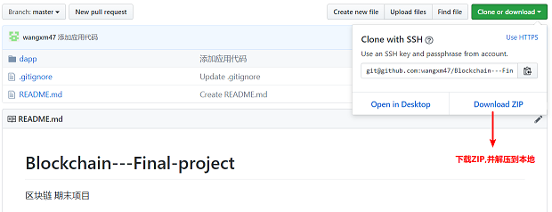

### 2. 安装环境

1. 安装[Node](https://nodejs.org/en/download/)
2. 安装 Truffle ：`npm install -g truffle`
3. 安装[Ganache](http://truffleframework.com/ganache/)
4. 安装[MetaMask](https://metamask.io/) 

### 3. 运行项目

1. 打开Ganache。Ganache默认会在7545端口上运行一个开发链。Ganache 启动之后是这样：

   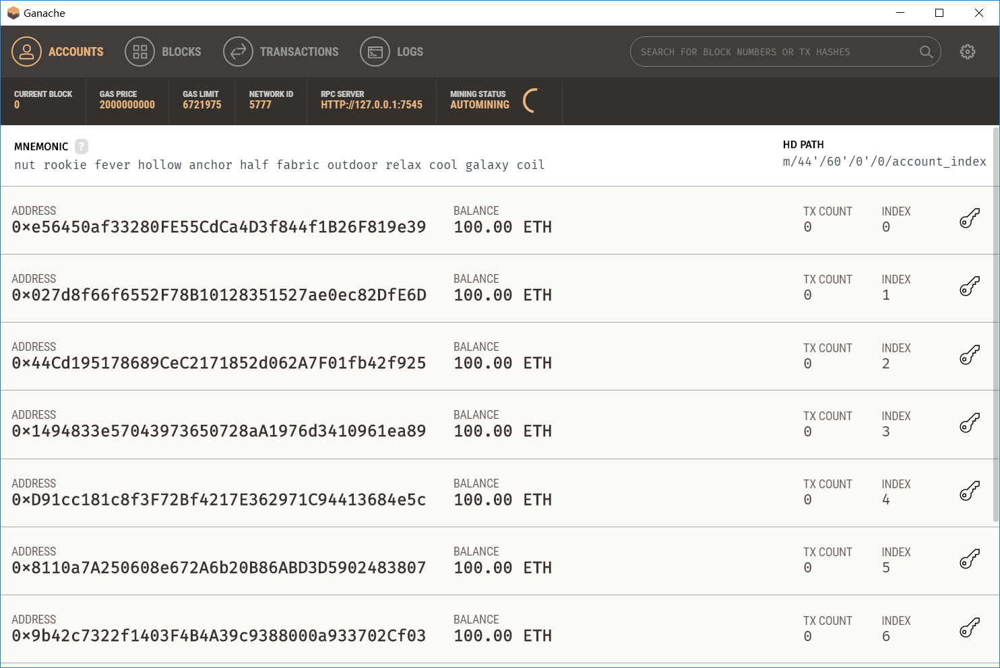

2. 打开Chrome浏览器,打开我们安装好的MetaMask,在接受隐私说明后，会出现页面如下：

   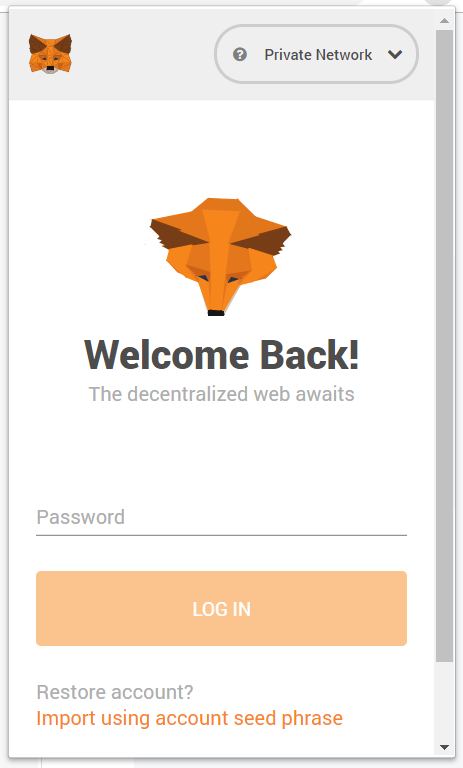

   这里我们通过还原一个Ganache为我们创建好的钱包，作为我们的开发测试钱包。(因为已经使用过所以界面略微不同)此时我们选择下方的`Import using account seed phrase` ，输入Ganache显示的助记词。

   ```
   nut rookie fever hollow anchor half fabric outdoor relax cool galaxy coil
   ```

   然后输入自己想要的密码,就进入了账户页面:

   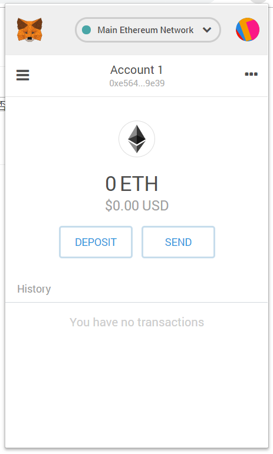

   默认连接的是以太坊主网（上方显示），选择**Custom RPC**，添加一个网络：**http://127.0.0.1:7545**，点返回后，显示如下：

   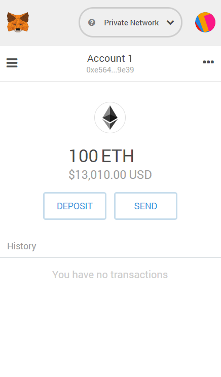

3. 进入解压好的`Blockchain---Final-project` 文件夹,进入`dapp`文件夹,打开命令行,输入`npm run dev` 此时浏览器会打开应用页面:

   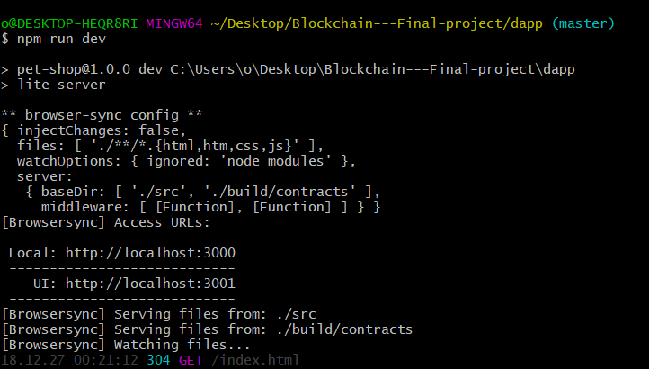

   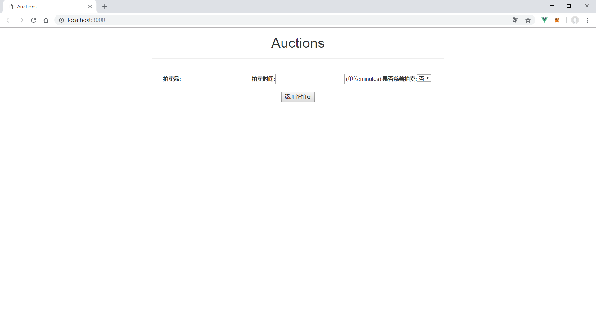  

4. 此时就可以添加新拍卖了

## 4. 测试

### 1. 添加新拍卖

1. 输入拍卖名`auction1`,拍卖时间`15分钟` 

   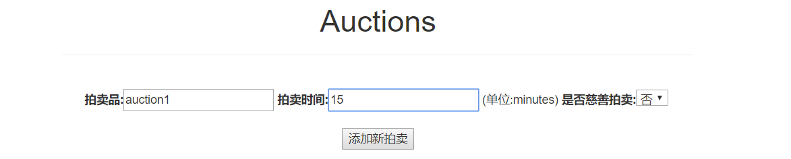

2. 点击添加新拍卖,MetaMask会弹出窗口,让你确认交易,选择确认,页面下方会出现新拍卖

   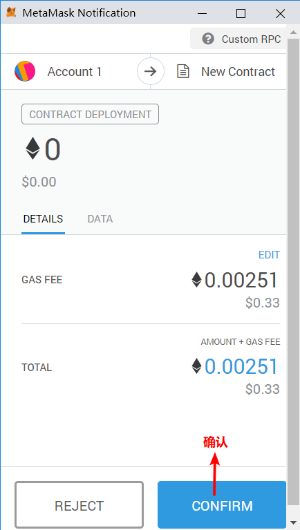

   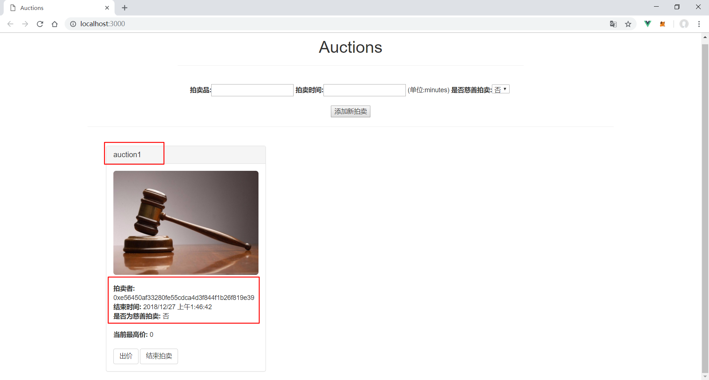 

### 2.竞价

1. 在MetaMask换一个账户出价,确认交易后会发现最高价改变

   

   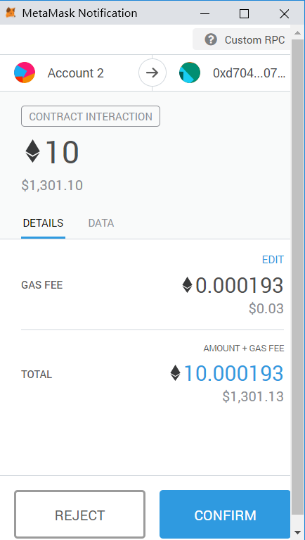

   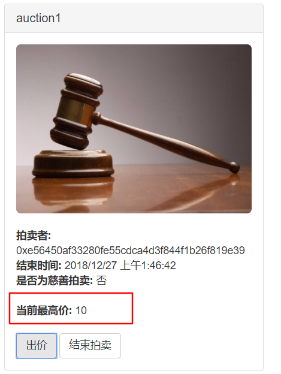

2. MetaMask也会出现交易条目

   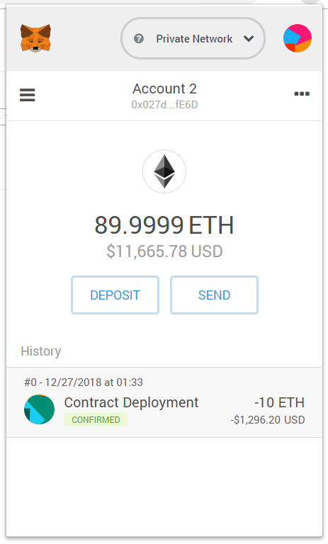

3. 这时我们换成`account3`进行一个低价的出价,MetaMask会在确认交易时报错,同时`Reject`后,网页也会报错

   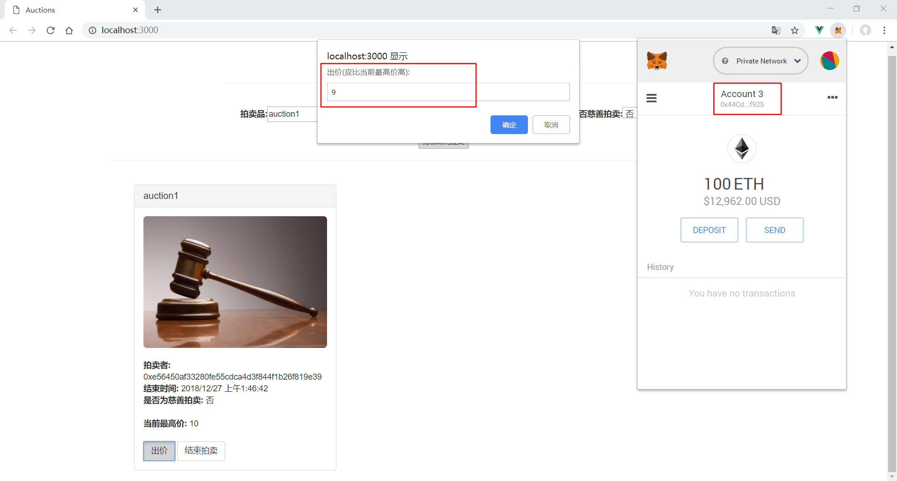

   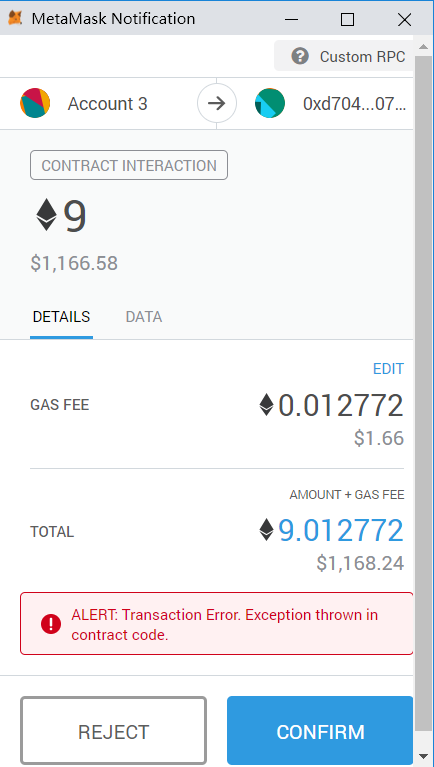

   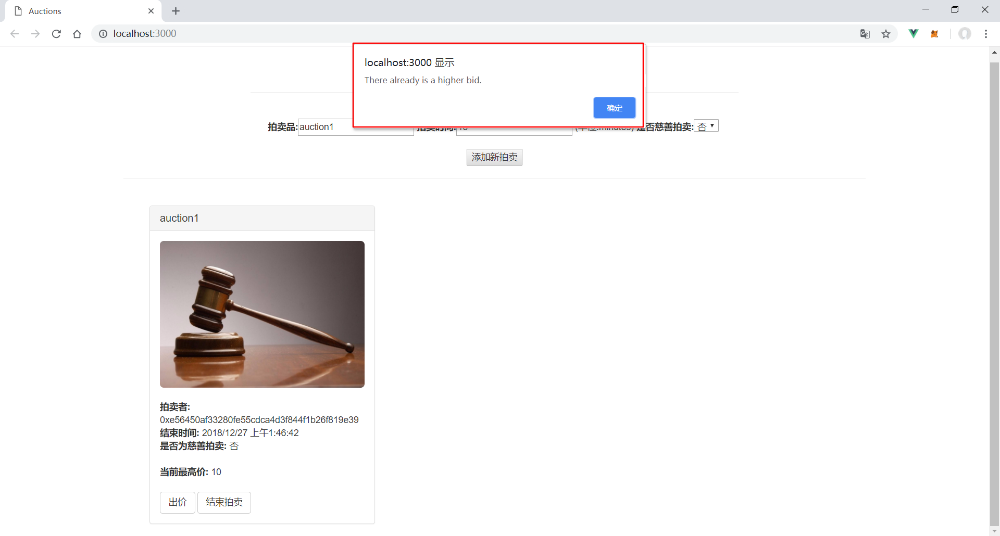

### 3.结束拍卖

1. 拍卖只能由发起人(即拍卖者)结束,其他人结束会报错,现在使用`account2`结束拍卖

   

2. `account1` 结束拍卖

   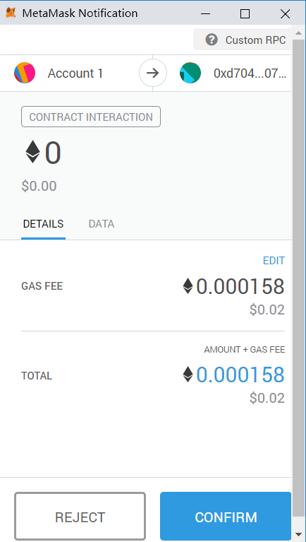

   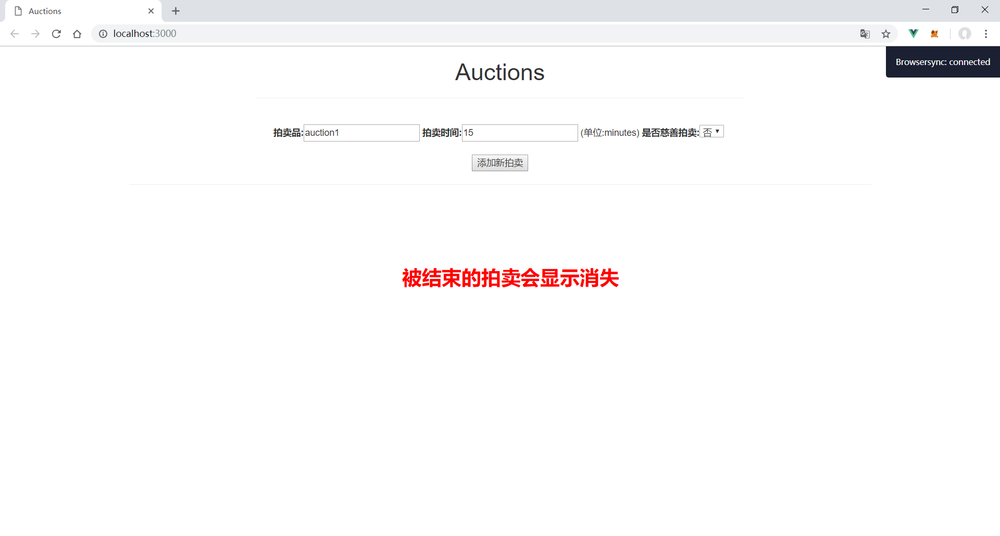

3. 此时查看账户情况

   * account1

     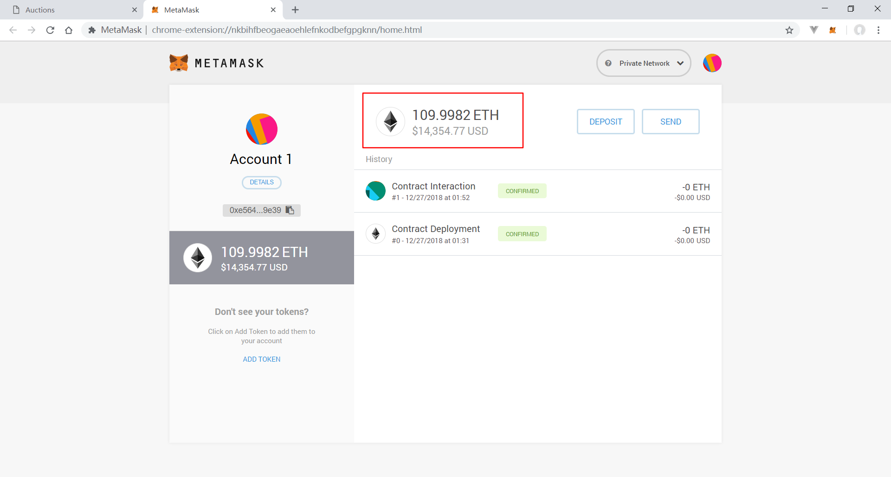

   * account2

     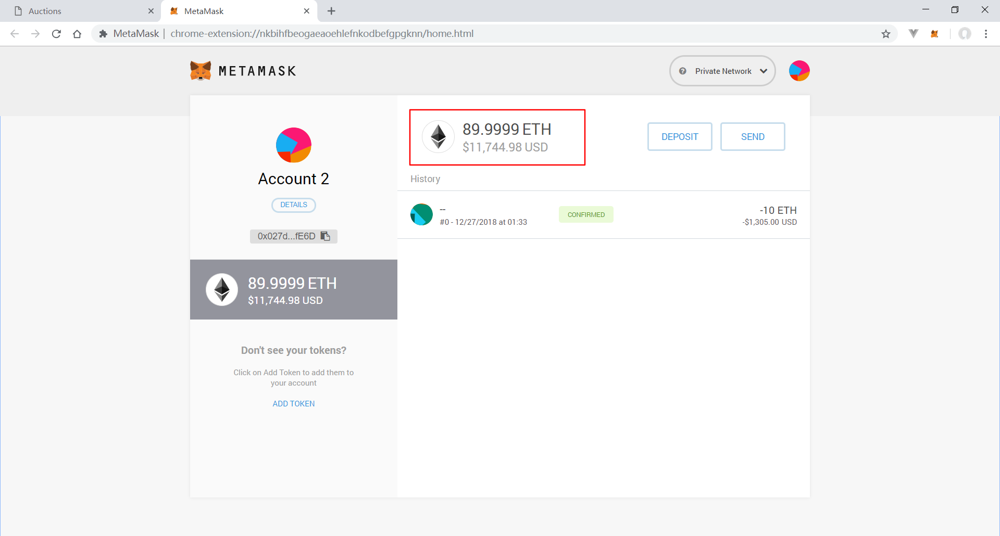

## 5. 总结

因为没有什么时间做这个项目,所以只实现了最基本最简陋的部分,还有很多想法没有实施,这学期在这门课还是对区块链这门新技术有了更多的了解,也学到了东西,虽然期末项目做的不好,但是还是收获了许多东西!
